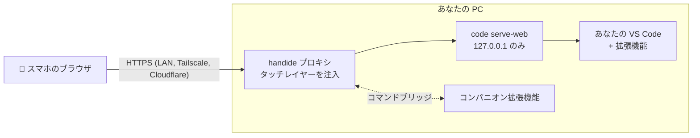

<div align="center">

# handide

**PC の VS Code を、スマホで。**

好きなフォルダで `handide` を実行して QR コードを読み取るだけで、スマホからコーディングできます。<br>
自分の VS Code、自分の拡張機能、自分の AI エージェントがそのまま使えます。フォークでもクラウド IDE でもありません。

[](LICENSE)


[English](README.md) · [한국어](README.ko.md) · **日本語** · [简体中文](README.zh-CN.md)

<br>

<table>
  <tr>
    <td align="center"><br><sub><b>コード</b>を画面いっぱいに</sub></td>
    <td align="center"><br><sub>フローティングボタン → <b>メニュー</b></sub></td>
    <td align="center"><br><sub><b>ファイル</b>ドロワー</sub></td>
    <td align="center"><br><sub><b>ターミナル</b>ドロワー</sub></td>
    <td align="center"><br><sub><b>AI</b> チャット</sub></td>
  </tr>
</table>

</div>

## 特長

- **あなたの VS Code そのもの。** PC にインストール済みの VS Code（`code serve-web`）をそのまま配信し、その上にタッチ用レイヤーを重ねるだけです。デスクトップの VS Code や Cursor に入れた拡張機能（Claude Code、Codex など）はコピーせずリンクして使います。
- **スマホに詰め込むのではなく、スマホ向けに設計。** 画面にはコードだけ。ファイル・ターミナル・AI はドロワーで開きます。補助キー（Esc・Tab・Ctrl・矢印）はキーボード表示中だけ現れ、日本語などの IME はネイティブ入力シートで問題なく入力できます。
- **ファイルは PC から出ません。** どこにもアップロードしません。スマホは画面にすぎません。
- **外出先でも。** コマンド 1 回で、モバイル回線でも使える固定の HTTPS アドレスができます。スマホには何もインストールしません。

## クイックスタート

> PC に **VS Code** 1.100 以上と **Node.js** 20 以上が必要です。

**1. インストール**

```sh
npm install -g github:YangJongWon/handide
```

**2. プロジェクトフォルダで実行**

```sh
cd ~/my-project
handide
```

**3. スマホのカメラで QR コードを読み取る**（同じ Wi-Fi）。ターミナルの QR が小さい場合は、PC のブラウザで **http://localhost:9000/__handide/connect** を開くと大きく表示されます。

初回だけ証明書の警告を許可し（handide が PC 用の HTTPS 証明書を自分で作るため）、VS Code にフォルダを信頼するか聞かれたら **信頼する** をタップしてください。

<details>
<summary>証明書の警告を進める手順</summary>

- **Android Chrome**: *詳細設定* → *… にアクセスする*
- **iPhone Safari**: *詳細を表示* → *このWebサイトを閲覧* → *Webサイトを閲覧*

HTTPS が必要な理由: VS Code はブラウザの*セキュアコンテキスト*（HTTPS または localhost）でしか接続しません。`http://192.168.x.x` では画面は出ても接続できません。

</details>

## 外出先で使う

```sh
handide remote   # 最初の 1 回だけ
```

PC に [Tailscale](https://tailscale.com) をインストールし、ブラウザを開いてサインイン（Google・Microsoft・GitHub・Apple アカウント）まで案内します。以後 `handide` は、自宅でもモバイル回線でも使える**固定**アドレス `https://<PC名>.<tailnet>.ts.net` を表示します。正規の証明書なので警告は出ず、**スマホには何もインストール不要**です。一度ブックマークすれば完了です。

| モード | コマンド | スマホに必要なもの | アドレス | アクセスできる人 |
|---|---|---|---|---|
| **公開リンク**（既定） | `handide` | なし | 固定 | リンク（トークン）を持つ人 |
| 自分の端末のみ | `handide --private` | Tailscale アプリ（同じアカウント） | 固定 | 自分の tailnet の端末のみ |
| アカウント不要 | `handide --cloudflare` | なし | 実行ごとに変わる | リンク（トークン）を持つ人 |
| LAN のみ | `handide --no-remote` | 同じ Wi-Fi | LAN IP | 自分のネットワーク |

> [!IMPORTANT]
> リンクに含まれるアクセストークン（`~/.handide/token`）は、ターミナルを含めあなたの VS Code を開く鍵です。パスワードと同じように扱ってください。`handide --new-token` で再発行すると、古いリンクは使えなくなります。

## スマホの画面構成

```
┌─────────────────────────────────┐
│  コード、全画面                  │   タブもサイドバーもなく、コードだけ
│                           (◉)   │   フローティングボタン → メニュー（ドラッグで移動）
├──── ⌄ Terminal ═══ ＋ 🗑 ────────┤   下から出るターミナルドロワー
└ ☰ Esc ⇥ Ctrl ← ↑ ↓ → ↶ 가 ⌄     ┘   入力中だけ出る補助キー
```

| | 開き方 | 閉じ方 |
|---|---|---|
| **メニュー** | フローティングボタン（入力中は補助キーの ☰） | 下にスワイプ、外側をタップ |
| **ファイル** | メニュー → ファイル、または左端からスワイプ | 左にスワイプ、外側をタップ |
| **ターミナル** | メニュー → ターミナル | バーを下にスワイプ、または ⌄ |
| **AI・拡張機能** | メニュー → AI·확장、または右端からスワイプ | 右にスワイプ、または › |

- メニューには現在のファイル（タップでクイックオープン）と、ファイル・ターミナル・AI・ファイル検索・コマンドパレット・保存・元に戻す・やり直しのタイルがあります。フローティングボタンの点は未保存の変更があることを示します。
- ファイルドロワーで新しいファイル・フォルダを作れます（最後に開いたフォルダの中に。`src/app.js` のようなパスも可）。フォルダボタンで PC 上の別のフォルダに切り替えることもできます。
- ターミナルバーの貼り付けボタンはクリップボードをシェルに送ります（スマホではターミナル内に貼り付けできないため）。
- **拡張機能の管理**: AI・拡張機能の一覧にある「확장 관리」（拡張機能の管理）には、無効なものも含めインストール済みの拡張機能がすべて表示されます。タップすると詳細ページ（有効化／無効化、アンインストール、設定）が開き、「확장 설치」（拡張機能のインストール）でマーケットプレイスを検索できます。
- **가** キーはネイティブの入力欄を開くので、日本語などどの IME で入力してもカーソル位置に入ります。
- **AI・拡張機能ドロワーではどの拡張機能のビューも開けます**: エージェント（Claude Code、Codex、VS Code の Chat など）だけでなく、普段はプライマリサイドバーやパネルにある拡張機能も。バーの名前をタップして選び、拡張機能自身のボタン（新しいチャット、履歴、更新）はその横に残ります。VS Code にはプライマリサイドバーの全画面表示がないため、そうしたビューは表示中だけセカンダリサイドバーに移し、別のものを選ぶと元に戻します。
- **AI バーの 🎤**: エージェントに話しかけて入力します。音声はスマホのブラウザが認識し（Chrome は Google、Safari は Apple）、VS Code のチャット入力欄に入ります。拡張機能のエージェントではテキストがコピーされるので、入力欄に貼り付けてください。マイクをもう一度押すか字幕をタップすると止まります。言語はスマホの設定に従い、設定ファイルの `"voiceLang": "ja-JP"` で変更できます。
- 折り返しあり、ミニマップなし、1.5 秒後に自動保存。

## カスタマイズ

`~/.handide/layer.config.json`（初回実行時に作成、ページを再読み込みすると反映）:

```json
{
  "menu": ["files", "terminal", "ai", "quickOpen", "palette", "save", "undo", "redo"],
  "accessoryKeys": ["esc", "tab", "ctrl", "left", "up", "down", "right", "undo", "input"],
  "breakpoint": 900,
  "companion": { "mode": "extension" }
}
```

<details>
<summary>すべてのオプション</summary>

- `menu` には `find` も入れられます。
- `accessoryKeys` には `alt`、`shift`、`home`、`end`、`redo`、`save`、`find`、`quickOpen`、`palette` も入れられます（☰ は常に先頭）。
- `breakpoint`: これより狭い画面でスマホレイアウトになります。
- `companion.mode: "builtin"`: コンパニオン拡張機能なしで動かします（VS Code 既定のショートカットを使用。ビューはスマホレイアウトで開かず、ドロワーからファイルを開けません）。
- `importExtensions: false`: デスクトップの拡張機能（`~/.vscode/extensions` と `~/.cursor/extensions` の各拡張機能の最新版）のリンクを止めます。リンクした拡張機能は固定（pinned）され、handide ではなくデスクトップのエディターでのみ更新されます。
- スマホ用の VS Code 設定はデスクトップの設定とは別に `~/.handide/data/Machine/settings.json` にあります。

</details>

<details>
<summary>コマンドラインオプション</summary>

```
handide [folder] [options]       folder の既定値はカレントディレクトリ
handide remote [--private]       外出先アクセスの初回設定

  --private          外出先リンクを自分の tailnet の端末に限定
  --cloudflare       アカウントなしの外出先リンク（実行ごとにアドレスが変わる）
  --no-remote        LAN のみ
  --local            この PC のみ（http://localhost、LAN・証明書なし）
  --port <n>         ポート（既定 9000）
  --new-token        アクセストークンを再発行
  --editor <path>    serve-web に対応したエディター CLI（既定: VS Code を自動検出）
  --cert/--key       自分で用意した HTTPS 証明書
  --reset-profile    スマホ用 VS Code 設定を handide の既定に戻す
```

一覧は `handide --help`。Android を USB で接続する場合: `handide --local` の後 `adb reverse tcp:9000 tcp:9000` を実行し、スマホで `http://localhost:9000/?tkn=<token>` を開きます。

</details>

## 仕組み



- `code serve-web` は VS Code 自身の「ブラウザで実行」機能です。handide は VS Code やデスクトップの設定を一切変更せず、スマホ用のプロファイルを `~/.handide` に別途置きます。
- タッチレイヤー（`layer/`）はページに注入される素の JS と CSS です。VS Code の DOM への依存はすべて `layer/selectors.json` にまとめてあり、アップデートで何かが動いても 1 行の修正で直せます。
- コンパニオン拡張機能（`extension/`）がレイヤーの代わりに公式の VS Code コマンド（ファイルを開く、フォルダ切り替え、ビュー表示）を実行します。

## よくある質問

<details>
<summary><b>Cursor などの VS Code フォークでも動きますか？</b></summary>

ホストは VS Code である必要があります（フォークには `serve-web` がありません）。デスクトップでは Cursor を使い続け、handide 用に VS Code を併せてインストールしてください。

</details>

<details>
<summary><b>スマホに「制限モード」が出る、またはデスクトップ版のような画面になる。</b></summary>

フォルダを**信頼**してください。それまで VS Code は handide のコンパニオンを含むすべての拡張機能を無効にしています。画面上部のお知らせの「신뢰 설정」（信頼の設定）ボタンで信頼画面が開きます。

</details>

<details>
<summary><b>同じ Wi-Fi なのに接続できない。</b></summary>

スマホと PC が同じネットワークにあるか、ファイアウォールがポート 9000 を許可しているか確認してください。または `handide remote` を一度実行して Tailscale のリンクを使えば、LAN の設定に関係なく接続できます。

</details>

<details>
<summary><b>公開リンクは安全ですか？</b></summary>

リンクのトークンがなければ VS Code は 403 を返し、接続ページは PC 自身にしか表示されません。トークンは長くランダムなので推測できませんが、リンクを*持っている*人は PC のターミナルまで使えます。リンクは共有しないか、`--private` で自分の Tailscale 端末だけに限定してください。

</details>

## コントリビューター向け

```sh
git clone https://github.com/YangJongWon/handide.git && cd handide
npm install && npm link
npm run check                  # Pixel 7 + iPhone 14 エミュレーション、各 23 項目
npm run check -- --android     # エミュレーターや USB 接続したスマホの実際の Chrome
```

チェックは `check-output/` 以下の専用データフォルダとサンプルワークスペースを使い、ステップごとにスクリーンショットを保存します。上のスクリーンショットは `node .claude/skills/mobilize-editor/scripts/screenshots.mjs` で撮り直せます。

リポジトリには Claude Code スキル（`.claude/skills/mobilize-editor`）が含まれています。Claude Code でリポジトリを開き、handide のセットアップ、VS Code 更新後の再検証・修復、レイアウト変更を頼んでください。

<details>
<summary>検証状況と既知の制限</summary>

最終検証: Windows の VS Code 1.138.0（Web サーバー 1.139+）。エミュレーションの Pixel 7 / iPhone 14 で 46/46（コンパニオン）。builtin モードは iPhone 14 でレイアウトチェックが断続的に失敗します。実機の iPhone で LAN、Tailscale Funnel、モバイル回線での接続を確認済み。

- フォルダの信頼はブラウザとフォルダごとに一度必要です。
- コンパニオンが使うレイアウトコマンドのいくつかは VS Code の内部コマンドです。`npm run compat` が未検証のバージョンを知らせ、`npm run check` で確認します。
- `serve-web` はデスクトップより新しい VS Code Web サーバーをダウンロードすることがあり、スマホ側の VS Code のほうが新しい場合があります。

</details>

## ライセンス

[MIT](LICENSE)
