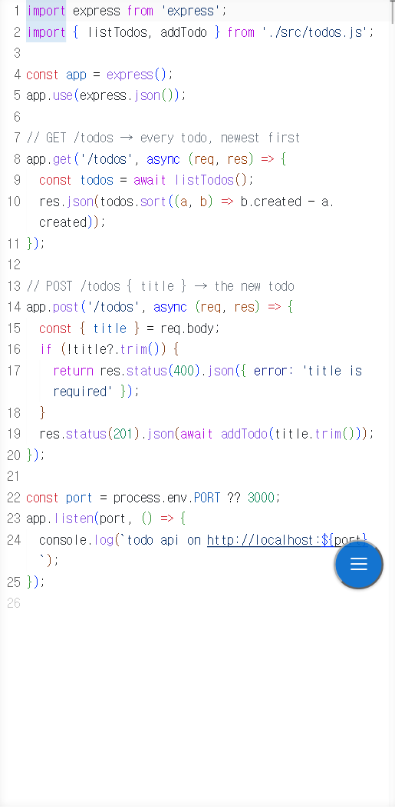
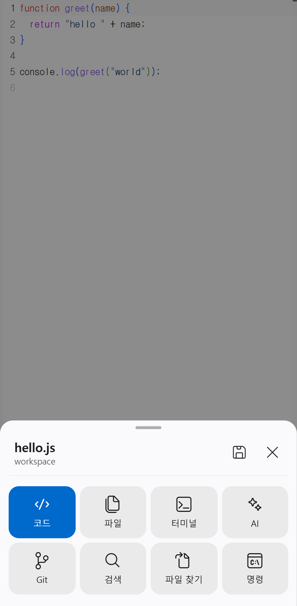
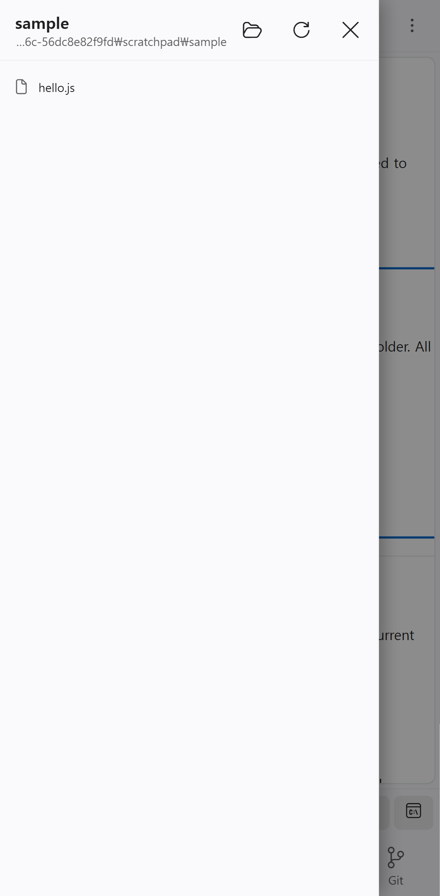
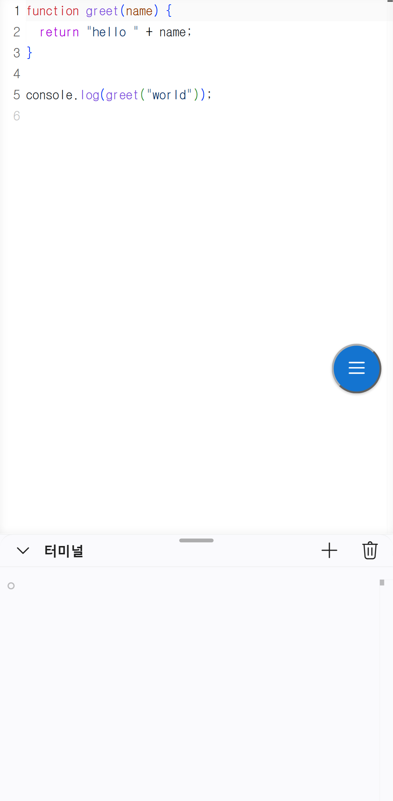
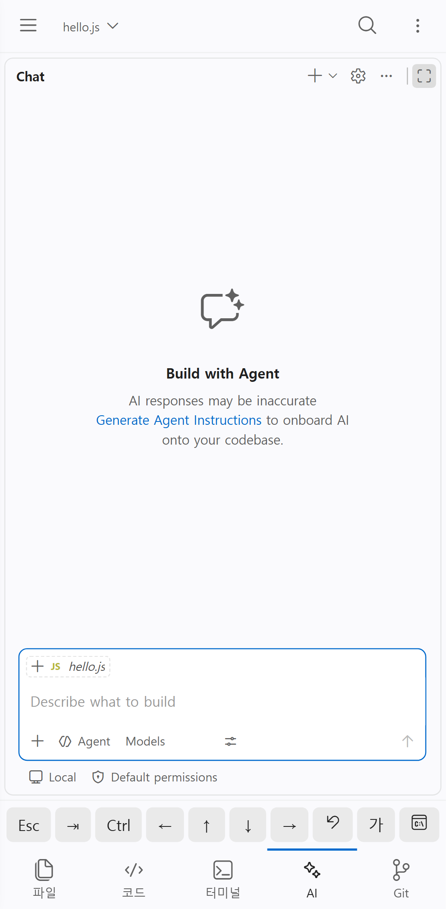
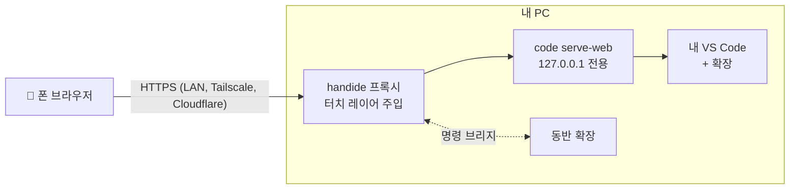

<div align="center">

# handide

**내 PC의 VS Code를, 폰에서.**

아무 폴더에서 `handide`를 실행하고 QR을 찍으면, 폰에서 바로 코딩합니다.<br>
내 VS Code, 내 확장, 내 AI 에이전트 그대로. 포크도 클라우드 IDE도 아닙니다.

[](LICENSE)


[English](README.md) · **한국어**

<br>

<table>
  <tr>
    <td align="center"><br><sub><b>코드</b>만 꽉 차게</sub></td>
    <td align="center"><br><sub>플로팅 버튼 → <b>메뉴</b></sub></td>
    <td align="center"><br><sub><b>파일</b> 드로어</sub></td>
    <td align="center"><br><sub><b>터미널</b> 드로어</sub></td>
    <td align="center"><br><sub><b>AI</b> 채팅</sub></td>
  </tr>
</table>

</div>

## 특징

- **내 VS Code 그대로.** PC에 설치된 VS Code(`code serve-web`)를 그대로 띄우고 그 위에 터치용 레이어만 얹습니다. Claude Code, Copilot 등 쓰던 확장이 그대로 동작합니다.
- **폰에 맞춰 다시 설계한 화면.** 화면은 코드 하나. 파일·터미널·AI는 드로어로 열립니다. 보조키(Esc·Tab·Ctrl·방향키)는 키보드가 올라왔을 때만 뜨고, 한글은 네이티브 입력 시트로 문제없이 입력됩니다.
- **파일은 PC에만.** 어디에도 업로드하지 않습니다. 폰은 화면일 뿐입니다.
- **집 밖에서도.** 명령 한 번이면 LTE에서도 되는 고정 HTTPS 주소가 생깁니다. 폰에는 아무것도 설치하지 않습니다.

## 빠른 시작

> PC에 **VS Code** 1.100+와 **Node.js** 20+가 필요합니다.

**1. 설치**

```sh
npm install -g github:YangJongWon/handide
```

**2. 프로젝트 폴더에서 실행**

```sh
cd ~/my-project
handide
```

**3. 폰 카메라로 QR 촬영** (같은 Wi-Fi). 터미널 QR이 작으면 PC 브라우저에서 **http://localhost:9000/__handide/connect** 를 열면 크게 보입니다.

처음 한 번은 인증서 경고를 넘기고(handide가 PC용 HTTPS 인증서를 직접 만들기 때문), VS Code가 폴더를 신뢰할지 물으면 **신뢰**를 누르세요.

<details>
<summary>인증서 경고 넘기는 법</summary>

- **Android 크롬**: *고급* → *…(으)로 이동*
- **iPhone Safari**: *세부사항 보기* → *이 웹사이트 방문* → *웹사이트 방문*

HTTPS가 필요한 이유: VS Code는 브라우저의 *보안 컨텍스트*(HTTPS 또는 localhost)에서만 연결됩니다. `http://192.168.x.x`로는 화면만 뜨고 연결이 안 됩니다.

</details>

## 집 밖에서 쓰기

```sh
handide remote   # 처음 한 번
```

PC에 [Tailscale](https://tailscale.com)을 설치하고, 브라우저를 열어 로그인(Google·Microsoft·GitHub·Apple 계정)까지 안내합니다. 그다음부터 `handide`는 집에서도 LTE에서도 그대로 되는 **고정 주소** `https://<PC이름>.<tailnet>.ts.net`을 보여 줍니다. 정식 인증서라 경고가 없고, **폰에는 설치할 것이 없습니다.** 한 번 북마크해 두면 끝입니다.

| 방식 | 명령 | 폰에 필요한 것 | 주소 | 접속 가능한 사람 |
|---|---|---|---|---|
| **공개 링크** (기본) | `handide` | 없음 | 고정 | 링크(토큰)를 가진 사람 |
| 내 기기만 | `handide --private` | Tailscale 앱 (같은 계정) | 고정 | 내 tailnet 기기만 |
| 계정 없이 | `handide --cloudflare` | 없음 | 실행마다 바뀜 | 링크(토큰)를 가진 사람 |
| 같은 Wi-Fi만 | `handide --no-remote` | 같은 Wi-Fi | LAN IP | 내 네트워크 |

> [!IMPORTANT]
> 링크 안의 접속 토큰(`~/.handide/token`)은 터미널을 포함해 내 VS Code를 여는 열쇠입니다. 비밀번호처럼 다루세요. `handide --new-token`으로 바꾸면 예전 링크는 더 이상 동작하지 않습니다.

## 폰 화면 구성

```
┌─────────────────────────────────┐
│  코드, 전체 화면                 │   탭도 사이드바도 없이 코드만
│                           (◉)   │   플로팅 버튼 → 메뉴 (드래그로 이동)
├──── ⌄ 터미널 ═══ ＋ 🗑 ──────────┤   아래에서 올라오는 터미널 드로어
└ ☰ Esc ⇥ Ctrl ← ↑ ↓ → ↶ 가 ⌄     ┘   입력 중일 때만 뜨는 보조키
```

| | 여는 법 | 닫는 법 |
|---|---|---|
| **메뉴** | 플로팅 버튼 (입력 중엔 보조키 ☰) | 아래로 쓸기, 바깥 탭 |
| **파일** | 메뉴 → 파일, 또는 왼쪽 가장자리에서 스와이프 | 왼쪽으로 쓸기, 바깥 탭 |
| **터미널** | 메뉴 → 터미널 | 바를 아래로 쓸기, 또는 ⌄ |
| **AI 채팅** | 메뉴 → AI, 또는 오른쪽 가장자리에서 스와이프 | 오른쪽으로 쓸기, 또는 › |

- 메뉴 상단에는 현재 파일(탭하면 빠른 열기), 아래에는 파일·터미널·AI·파일 찾기·명령 팔레트·저장·실행 취소·다시 실행이 있습니다. 플로팅 버튼의 점은 저장 안 된 변경이 있다는 뜻입니다.
- 파일 드로어의 폴더 버튼으로 PC의 다른 폴더로 바꿀 수 있습니다.
- **가** 키는 네이티브 입력창을 열어, 한글 등 어떤 IME로 입력해도 커서 위치에 들어갑니다.
- **AI 바의 🎤**: 에이전트에게 말로 입력합니다. 폰 브라우저가 음성을 인식해(크롬은 Google, Safari는 Apple) 채팅 입력창에 넣어 줍니다. 마이크를 다시 누르거나 자막을 탭하면 멈춥니다. 언어는 폰 설정을 따르고, 설정 파일의 `"voiceLang": "en-US"`로 바꿀 수 있습니다.
- 자동 줄바꿈, 미니맵 없음, 1.5초 뒤 자동 저장.

## 설정 바꾸기

`~/.handide/layer.config.json` (처음 실행 때 생성, 페이지를 새로고침하면 적용):

```json
{
  "menu": ["files", "terminal", "ai", "quickOpen", "palette", "save", "undo", "redo"],
  "accessoryKeys": ["esc", "tab", "ctrl", "left", "up", "down", "right", "undo", "input"],
  "breakpoint": 900,
  "companion": { "mode": "extension" }
}
```

<details>
<summary>전체 옵션</summary>

- `menu`에는 `find`도 넣을 수 있습니다.
- `accessoryKeys`에는 `alt`, `shift`, `home`, `end`, `redo`, `save`, `find`, `quickOpen`, `palette`도 넣을 수 있습니다(☰는 항상 맨 앞).
- `breakpoint`: 이보다 좁은 화면에서 폰 레이아웃이 적용됩니다.
- `companion.mode: "builtin"`: 동반 확장 없이 실행합니다(VS Code 기본 단축키 사용, 뷰가 폰 레이아웃으로 열리지 않고 드로어에서 파일을 열 수 없음).
- 폰용 VS Code 설정은 데스크톱 설정과 따로 `~/.handide/data/Machine/settings.json`에 있습니다.

</details>

<details>
<summary>명령줄 옵션</summary>

```
handide [폴더] [옵션]            폴더 기본값은 현재 디렉터리
handide remote [--private]       집 밖 접속 1회 설정

  --private          집 밖 링크를 내 tailnet 기기로만 제한
  --cloudflare       계정 없이 집 밖 링크 (실행마다 주소가 바뀜)
  --no-remote        같은 Wi-Fi에서만
  --local            이 PC에서만 (http://localhost, 인증서 없음)
  --port <n>         포트 (기본 9000)
  --new-token        접속 토큰 새로 발급
  --editor <path>    serve-web을 지원하는 에디터 CLI (기본: VS Code 자동 탐지)
  --cert/--key       직접 준비한 HTTPS 인증서
  --reset-profile    폰용 VS Code 설정을 handide 기본값으로 되돌림
```

전체 목록은 `handide --help`. Android를 USB로 연결했다면: `handide --local` 후 `adb reverse tcp:9000 tcp:9000`, 폰에서 `http://localhost:9000/?tkn=<토큰>`.

</details>

## 동작 방식



- `code serve-web`은 VS Code에 내장된 "브라우저에서 실행" 기능입니다. handide는 VS Code나 데스크톱 설정을 건드리지 않고, 폰용 프로필을 `~/.handide`에 따로 둡니다.
- 터치 레이어(`layer/`)는 페이지에 주입되는 JS·CSS입니다. VS Code DOM에 의존하는 부분은 모두 `layer/selectors.json`에 모여 있어서, 업데이트로 뭔가 바뀌어도 한 줄 수정으로 고칠 수 있습니다.
- 동반 확장(`extension/`)은 레이어 대신 공식 VS Code 명령(파일 열기, 폴더 전환, 뷰 표시)을 실행합니다.

## 자주 묻는 질문

<details>
<summary><b>Cursor 같은 VS Code 포크로도 되나요?</b></summary>

호스트는 VS Code여야 합니다(포크에는 `serve-web`이 없음). 데스크톱에서는 Cursor를 계속 쓰고, handide용으로 VS Code를 함께 설치하면 됩니다.

</details>

<details>
<summary><b>폰에 "제한 모드"가 뜨거나 데스크톱 화면처럼 보여요.</b></summary>

폴더를 **신뢰**하세요. 그 전에는 VS Code가 handide 동반 확장을 포함한 모든 확장을 꺼 둡니다.

</details>

<details>
<summary><b>같은 Wi-Fi인데 연결이 안 돼요.</b></summary>

폰과 PC가 같은 네트워크인지, 방화벽이 9000 포트를 막지 않는지 확인하세요. 아니면 `handide remote`를 한 번 실행하고 Tailscale 링크를 쓰면 LAN 설정과 상관없이 접속됩니다.

</details>

<details>
<summary><b>공개 링크, 안전한가요?</b></summary>

링크 속 토큰이 없으면 VS Code는 403으로 거부하고, 연결 페이지는 PC 자신에게만 열립니다. 토큰은 길고 무작위라 추측할 수 없지만, 링크를 *가진* 사람은 PC 터미널까지 쓸 수 있습니다. 링크를 공유하지 말거나, `--private`로 내 Tailscale 기기만 접속하게 하세요.

</details>

## 기여하기

```sh
git clone https://github.com/YangJongWon/handide.git && cd handide
npm install && npm link
npm run check                  # Pixel 7 + iPhone 14 에뮬레이션, 기기당 19개 검사
npm run check -- --android     # 에뮬레이터나 USB로 연결한 폰의 실제 크롬
```

검사는 `check-output/` 아래의 별도 데이터 폴더와 샘플 워크스페이스를 쓰고, 단계마다 스크린샷을 남깁니다. 위 스크린샷은 `node .claude/skills/mobilize-editor/scripts/screenshots.mjs`로 다시 찍습니다.

저장소에는 Claude Code 스킬(`.claude/skills/mobilize-editor`)이 들어 있습니다. Claude Code에서 저장소를 열고 handide 설치, VS Code 업데이트 후 재검증·수리, 레이아웃 변경을 요청하면 됩니다.

<details>
<summary>검증 상태와 알려진 제한</summary>

마지막 검증: Windows의 VS Code 1.138.0(웹 서버 1.139+). 에뮬레이션 Pixel 7 / iPhone 14에서 38/38(동반 확장). builtin 모드는 iPhone 14에서 레이아웃 검사가 간헐적으로 실패합니다. 실제 iPhone으로 LAN, Tailscale Funnel, LTE 접속 확인.

- 폴더 신뢰는 브라우저·폴더마다 한 번 필요합니다.
- 동반 확장이 쓰는 레이아웃 명령 몇 개는 VS Code 내부 명령입니다. `npm run compat`이 검증 안 된 버전을 알려 주고, `npm run check`로 확인합니다.
- `serve-web`이 데스크톱보다 새 VS Code 웹 서버를 받을 수 있어서, 폰 쪽 VS Code 버전이 더 높을 수 있습니다.

</details>

## 라이선스

[MIT](LICENSE)
