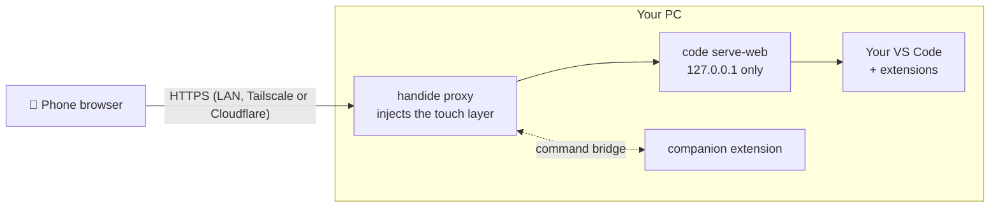

<div align="center">

# handide

**Your real VS Code, on your phone.**

Run `handide` in any folder, scan the QR code, and code from your phone —<br>
with your own VS Code, your extensions and your AI agents. Not a fork, not a cloud IDE.

[](LICENSE)


**English** · [한국어](README.ko.md)

<br>

<table>
  <tr>
    <td align="center"><br><sub><b>Code</b>, edge to edge</sub></td>
    <td align="center"><br><sub><b>Menu</b> from the floating button</sub></td>
    <td align="center"><br><sub><b>Files</b> drawer</sub></td>
    <td align="center"><br><sub><b>Terminal</b> drawer</sub></td>
    <td align="center"><br><sub><b>AI</b> chat</sub></td>
  </tr>
</table>

</div>

## Why handide

- **It's your VS Code.** handide serves the VS Code installed on your PC (`code serve-web`) and adds a touch layer on top. Claude Code, Copilot and the rest of your extensions keep working.
- **Made for a phone, not squeezed onto one.** One screen: the code. Files, terminal and AI slide in as drawers; accessory keys (Esc, Tab, Ctrl, arrows) appear only while the keyboard is up; Korean and other IMEs work through a native input sheet.
- **Your files stay on your PC.** Nothing is uploaded anywhere. The phone is just a screen.
- **Works away from home.** One command sets up a fixed HTTPS address that works on mobile data — nothing to install on the phone.

## Quick start

> Requires **VS Code** 1.100+ and **Node.js** 20+ on the PC.

**1. Install**

```sh
npm install -g github:YangJongWon/handide
```

**2. Run it in a project folder**

```sh
cd ~/my-project
handide
```

**3. Scan the QR code** with the phone camera (same Wi-Fi). The terminal QR too small? Open **http://localhost:9000/__handide/connect** on the PC for a big one.

On the first visit, accept the certificate warning once (handide makes its own HTTPS certificate for your PC) and tap **Trust** when VS Code asks about the folder.

<details>
<summary>Certificate warning, step by step</summary>

- **Android Chrome**: *Advanced* → *Proceed to …*
- **iPhone Safari**: *Show Details* → *visit this website* → *Visit Website*

Why HTTPS at all: VS Code only connects from a browser *secure context* (HTTPS or localhost). Plain `http://192.168.x.x` would load the page and then never connect.

</details>

## Use it away from home

```sh
handide remote   # once
```

It installs [Tailscale](https://tailscale.com) on the PC and opens the browser to sign in (Google, Microsoft, GitHub or Apple account). From then on, `handide` prints a **fixed** `https://<your-pc>.<tailnet>.ts.net` link that works at home and on mobile data, with a valid certificate and **nothing to install on the phone**. Bookmark it once.

| Mode | Command | Phone needs | Address | Who can reach it |
|---|---|---|---|---|
| **Public link** (default) | `handide` | nothing | fixed | anyone with the link + token |
| Own devices only | `handide --private` | Tailscale app, same account | fixed | only your tailnet devices |
| No account at all | `handide --cloudflare` | nothing | new on every run | anyone with the link + token |
| LAN only | `handide --no-remote` | same Wi-Fi | LAN IP | your network |

> [!IMPORTANT]
> The link contains an access token (kept in `~/.handide/token`) that unlocks your VS Code, including its terminal. Treat it like a password. `handide --new-token` replaces it; old links stop working.

## The phone layout

```
┌─────────────────────────────────┐
│  code, full screen              │   no tabs, no side bars: only the code
│                           (◉)   │   floating button → menu (drag it anywhere)
├──── ⌄ Terminal ═══ ＋ 🗑 ────────┤   terminal drawer from the bottom
└ ☰ Esc ⇥ Ctrl ← ↑ ↓ → ↶ 가 ⌄     ┘   accessory keys, only while typing
```

| | How to open | How to close |
|---|---|---|
| **Menu** | tap the floating button (or ☰ on the keys) | swipe down, tap outside |
| **Files** | menu → Files, or swipe from the left edge | swipe left, tap outside |
| **Terminal** | menu → Terminal | swipe the bar down, or ⌄ |
| **AI chat** | menu → AI, or swipe from the right edge | swipe right, or › |

- The menu shows the active file (tap it for quick open) and tiles for Files, Terminal, AI, Find file, Command palette, Save, Undo and Redo. A dot on the floating button means unsaved changes.
- The file drawer can switch to any folder on the PC (folder button).
- **가** opens a native text box, so any IME (Korean, Japanese, …) types into the editor at the cursor.
- Word wrap on, no minimap, autosave after 1.5 s.

## Customize

`~/.handide/layer.config.json` (created on first run; reload the page to apply):

```json
{
  "menu": ["files", "terminal", "ai", "quickOpen", "palette", "save", "undo", "redo"],
  "accessoryKeys": ["esc", "tab", "ctrl", "left", "up", "down", "right", "undo", "input"],
  "breakpoint": 900,
  "companion": { "mode": "extension" }
}
```

<details>
<summary>All options</summary>

- `menu` can also hold `find`.
- `accessoryKeys` can also hold `alt`, `shift`, `home`, `end`, `redo`, `save`, `find`, `quickOpen` and `palette` (☰ is always first).
- `breakpoint`: screens narrower than this get the phone layout.
- `companion.mode: "builtin"` runs without the companion extension (VS Code's default shortcuts; views open but not in the phone layout, and the drawer can't open files).
- The phone's VS Code settings live in `~/.handide/data/Machine/settings.json`, separate from your desktop settings.

</details>

<details>
<summary>Command-line options</summary>

```
handide [folder] [options]       folder defaults to the current directory
handide remote [--private]       one-time setup for access away from home

  --private          away-from-home link only for your tailnet devices
  --cloudflare       away-from-home link without any account (new address each run)
  --no-remote        LAN only
  --local            this PC only (http://localhost), no LAN, no certificate
  --port <n>         port (default 9000)
  --new-token        issue a new access token
  --editor <path>    editor CLI with serve-web (default: auto-detect VS Code)
  --cert/--key       your own HTTPS certificate
  --reset-profile    restore handide's default mobile settings
```

`handide --help` lists everything. Android over USB: `handide --local`, then `adb reverse tcp:9000 tcp:9000` and open `http://localhost:9000/?tkn=<token>` on the phone.

</details>

## How it works



- `code serve-web` is VS Code's own "run in a browser" feature. handide never modifies VS Code or your desktop settings; the phone gets its own profile in `~/.handide`.
- The touch layer (`layer/`) is plain JS and CSS injected into the page. Every dependency on VS Code's DOM is listed in `layer/selectors.json`, so an update that moves something is a one-line fix.
- The companion extension (`extension/`) runs official VS Code commands for the layer (open a file, switch folder, show a view).

## FAQ

<details>
<summary><b>Does it work with Cursor or other VS Code forks?</b></summary>

The host has to be VS Code, because forks don't ship `serve-web`. You can keep using Cursor on the desktop and install VS Code next to it for handide.

</details>

<details>
<summary><b>The phone shows "Restricted Mode" or the layout looks like desktop VS Code.</b></summary>

Tap **Trust** for the folder. Until then VS Code keeps all extensions off, including handide's companion.

</details>

<details>
<summary><b>The phone can't connect on Wi-Fi.</b></summary>

Check that the phone and PC are on the same network and that the firewall allows port 9000. Or skip the LAN entirely: `handide remote` once, then use the Tailscale link.

</details>

<details>
<summary><b>Is the public link safe?</b></summary>

Without the token in the link, VS Code answers 403 and the connect page is only served to the PC itself. The token is long and random, so it can't be guessed, but anyone who *has* the link can use your PC's terminal. Keep it private, or use `--private` so only your own Tailscale devices can reach it.

</details>

## For contributors

```sh
git clone https://github.com/YangJongWon/handide.git && cd handide
npm install && npm link
npm run check                  # Pixel 7 + iPhone 14 emulation, 18 checks each
npm run check -- --android     # real Chrome on an emulator or USB phone
```

Each check run uses a private data dir and sample workspace under `check-output/` and writes a screenshot per step. `node .claude/skills/mobilize-editor/scripts/screenshots.mjs` retakes the screenshots above.

The repo includes a Claude Code skill (`.claude/skills/mobilize-editor`): open the repo in Claude Code and ask it to set up handide, re-verify it after a VS Code update, fix what an update broke, or change your layout.

<details>
<summary>Verification status and known limitations</summary>

Last verified: VS Code 1.138.0 (web server 1.139+) on Windows. Emulated Pixel 7 / iPhone 14: 36/36 (companion) and 34/34 (builtin); used on a physical iPhone over LAN, Tailscale Funnel and mobile data.

- The folder must be trusted once per browser and folder.
- A few layout commands the companion uses are internal to VS Code. `npm run compat` flags untested versions and `npm run check` confirms them.
- `serve-web` can download a newer VS Code web server than your desktop version, so the phone may run a newer VS Code than the one you tested with.

</details>

## License

[MIT](LICENSE)
