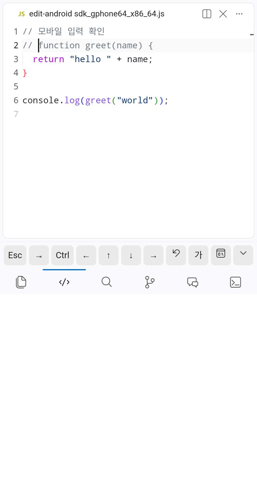
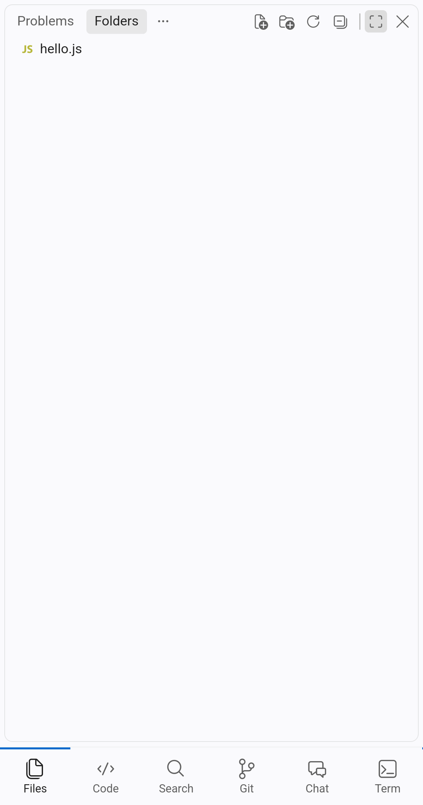

# handide

**Your real VS Code, usable on a phone.** handide serves the VS Code already installed on your PC (or a server) to a phone browser and adds a touch-first layer on top: one full-screen area per tab, an accessory key row, and an input sheet that works with any IME. VS Code itself is not forked or modified, so your extensions (Claude Code, Copilot, …) keep working.

<p>


</p>

> **한국어 요약**
> PC에 설치된 VS Code 원본을 그대로 폰 브라우저로 띄우고, 그 위에 모바일 레이어를 입힙니다. 하단 탭 한 번에 한 영역이 전체 화면으로 뜨고, 보조키 줄(Esc·Tab·방향키·Ctrl)과 한글 입력 시트가 있습니다. VS Code를 포크하지 않으므로 Claude Code·Copilot 같은 확장이 그대로 동작합니다.
> 가장 쉬운 설치: 이 레포를 받아 **Claude Code로 열고 "handide 설치해줘"라고 하면** 포함된 `mobilize-editor` 스킬이 호환성 점검부터 실행까지 안내합니다. VS Code가 업데이트돼 화면이 깨지면 같은 스킬이 점검하고 고칩니다.
> PC에서 `npm start`를 실행하면 터미널에 **QR 코드와 링크**가 뜹니다. 터미널 QR이 잘 안 찍히면 PC 브라우저에서 `http://localhost:9000/__handide/connect`를 열면 QR이 크게 보입니다. 폰 카메라로 QR을 찍거나 링크를 열면 바로 연결됩니다(첫 방문 때 인증서 경고를 한 번 넘기면 됩니다).

## How it works

```
phone browser ──https──> handide proxy ──> code serve-web (127.0.0.1 only) ──> your VS Code
                           │
                           ├─ injects layer/  (mobile.css + mobile.js)
                           ├─ mobile profile  (VS Code settings, in a private data dir)
                           └─ companion extension (tab switching via official commands)
```

- `code serve-web` is VS Code's own "run in a browser" feature. The proxy injects the mobile layer into the page it serves and forwards everything else untouched.
- Your desktop VS Code settings are never touched; handide keeps its own data in `.handide-data/`.
- Anything a VS Code setting can do is done with a setting. Everything that depends on VS Code internals is listed in one file, `layer/selectors.json`, so an editor update means fixing one file (the skill does it).

## Requirements

- **VS Code** 1.100 or newer (the tested version is in `layer/selectors.json`). Cursor, Windsurf and other forks can't be the host: they have no `serve-web`. They can be installed next to VS Code.
- **Node.js** 20+
- A phone on the same network (or Tailscale / USB for other setups, see below).

## Quick start with Claude Code (recommended)

```sh
git clone https://github.com/YangJongWon/handide.git && cd handide
claude
> set up handide        # or: handide 설치해줘
```

The bundled skill (`.claude/skills/mobilize-editor`) checks your editor version, lets you choose how the companion extension is installed if the versions are untested, runs the automated check and starts the server.

## Manual quick start

```sh
npm install
npm run compat                        # is my VS Code compatible?
npm start -- --folder ~/my-project    # prints a QR code + link for the phone
```

### Open it on your phone

`npm start` opens handide on your LAN over HTTPS and prints a **QR code and a link**. Scan the QR code with the phone camera (or open the link on any device on the same network) and you are in: the link carries the access token.

If the QR code is hard to scan in your terminal, open **http://localhost:9000/__handide/connect** in the PC's browser: it shows the same QR code large, with the link and a copy button. That page only answers requests from the PC itself, because it contains the token.

The first visit shows a certificate warning, because handide makes its own certificate for your PC (stored in `.handide-data/tls`). Accept it once: Android Chrome → *Advanced* → *Proceed*; iPhone Safari → *Show Details* → *visit this website*. Typing `http://` instead of `https://` redirects automatically.

Why HTTPS: VS Code's connection needs a browser *secure context* (HTTPS or localhost). Plain `http://192.168.x.x` would load the page but never connect.

| Situation | How |
|---|---|
| Phone on the same Wi-Fi (default) | `npm start` → scan the QR code |
| Away from home | `npm start -- --local`, then `tailscale serve --bg 9000` → `https://<machine>.<tailnet>.ts.net/?tkn=<token>` (valid certificate, no warning) |
| Android phone over USB | `npm start -- --local`, `adb reverse tcp:9000 tcp:9000`, open `http://localhost:9000/?tkn=<token>` |
| Your own certificate | `npm start -- --cert cert.pem --key key.pem` |
| This PC only | `npm start -- --local` |

The token in the link is the only authentication: share it only with your own devices, and don't expose the port on a public network.

On first open VS Code asks whether you trust the folder. Tap **Trust**: until then VS Code disables extensions, including handide's tab switching and agent extensions.

## Using it

- **Bottom tabs**: Code · Files · Search · Git · Chat · Terminal. Each shows one area full screen.
- **Accessory keys** (while typing): Esc, Tab, sticky Ctrl, arrows, undo, **가** (input sheet), command palette. With the soft keyboard open the tab bar shrinks to icons and a ⌄ key hides the keyboard.
- **Input sheet (가)**: type in a native text box (any IME, including Korean) and insert at the cursor.
- Files autosave after 1.5 s.

## Customize

Edit `layer.config.json` (reload the page to apply):

```json
{
  "tabs": ["code", "files", "search", "git", "chat", "terminal"],
  "accessoryKeys": ["esc", "tab", "ctrl", "left", "up", "down", "right", "undo", "input", "palette"],
  "breakpoint": 900,
  "companion": { "mode": "extension" }
}
```

`companion.mode: "builtin"` runs without the companion extension (VS Code's default shortcuts; areas open but don't go full screen). Mobile-only VS Code settings live in `profile/settings.json`.

## Verify

```sh
npm run check                         # Pixel 7 + iPhone 14 emulation, 15 checks each
npm run check -- --mode builtin
npm run check -- --android            # real Chrome on an emulator or USB phone (real touches, soft keyboard)
```

Each run uses a private data dir and sample workspace under `check-output/`, writes `check-output/report.json` and a screenshot per step.

Last verified: VS Code 1.138.0 on Windows — emulated Pixel 7 / iPhone 14 (both modes) and Android 15 emulator with Chrome 124.

## Known limitations

- Not yet tested on a physical iPhone (only iPhone emulation in Chromium) or a physical Android phone.
- The folder must be trusted once per browser (VS Code disables third-party extensions in Restricted Mode).
- The companion extension relies on a few layout commands that are internal to VS Code; `npm run compat` flags untested versions and `npm run check` confirms them.
- Agent Hub (one place for Claude Code / Copilot agent / Cursor background agent results) is planned, not built.

## License

MIT
