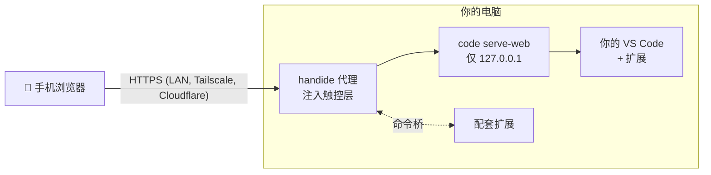

<div align="center">

# handide

**把电脑上的 VS Code，装进手机。**

在任意文件夹运行 `handide`，扫描二维码，就能在手机上写代码。<br>
用的是你自己的 VS Code、你自己的扩展和 AI 智能体。不是分支版本，也不是云端 IDE。

[](LICENSE)


[English](README.md) · [한국어](README.ko.md) · [日本語](README.ja.md) · **简体中文**

<br>

<table>
  <tr>
    <td align="center"><br><sub><b>代码</b>铺满屏幕</sub></td>
    <td align="center"><br><sub>悬浮按钮 → <b>菜单</b></sub></td>
    <td align="center"><br><sub><b>文件</b>抽屉</sub></td>
    <td align="center"><br><sub><b>终端</b>抽屉</sub></td>
    <td align="center"><br><sub><b>AI</b> 聊天</sub></td>
  </tr>
</table>

</div>

## 为什么选 handide

- **就是你的 VS Code。** handide 直接提供你电脑上安装的 VS Code（`code serve-web`），只在上面加一层触控界面。你在桌面版 VS Code 和 Cursor 里装的扩展（Claude Code、Codex 等）以链接方式接入，不做复制。
- **为手机设计，而不是硬塞进手机。** 屏幕上只有代码。文件、终端和 AI 以抽屉形式滑出；辅助键（Esc、Tab、Ctrl、方向键）只在键盘弹出时出现；中文等输入法通过原生输入框正常输入。
- **文件只留在你的电脑上。** 不上传到任何地方，手机只是一块屏幕。
- **出门在外也能用。** 一条命令即可获得在移动网络下也能访问的固定 HTTPS 地址，手机上什么都不用装。

## 快速开始

> 电脑上需要 **VS Code** 1.100+ 和 **Node.js** 20+。

**1. 安装**

```sh
npm install -g github:YangJongWon/handide
```

**2. 在项目文件夹中运行**

```sh
cd ~/my-project
handide
```

**3. 用手机相机扫描二维码**（同一 Wi-Fi）。终端里的二维码太小？在电脑浏览器打开 **http://localhost:9000/__handide/connect** 查看大图。

首次访问时接受一次证书警告（handide 会为你的电脑自行生成 HTTPS 证书）。

<details>
<summary>如何跳过证书警告</summary>

- **Android Chrome**：*高级* → *继续前往…*
- **iPhone Safari**：*显示详细信息* → *访问此网站* → *访问网站*

为什么必须用 HTTPS：VS Code 只在浏览器的*安全上下文*（HTTPS 或 localhost）中连接。用 `http://192.168.x.x` 页面能打开，但永远连不上。

</details>

## 出门在外使用

```sh
handide remote   # 只需一次
```

它会在电脑上安装 [Tailscale](https://tailscale.com)，并打开浏览器引导你登录（Google、Microsoft、GitHub 或 Apple 账号）。之后 `handide` 会显示一个**固定**的 `https://<电脑名>.<tailnet>.ts.net` 链接，在家和移动网络下都能用，证书有效，**手机上无需安装任何东西**。收藏一次即可。

| 模式 | 命令 | 手机需要 | 地址 | 谁能访问 |
|---|---|---|---|---|
| **公开链接**（默认） | `handide` | 无 | 固定 | 持有链接和令牌的人 |
| 仅自己的设备 | `handide --private` | Tailscale 应用，同一账号 | 固定 | 仅你 tailnet 中的设备 |
| 无需账号 | `handide --cloudflare` | 无 | 每次运行都会变 | 持有链接和令牌的人 |
| 仅局域网 | `handide --no-remote` | 同一 Wi-Fi | 局域网 IP | 你的网络 |

> [!IMPORTANT]
> 链接中包含访问令牌（保存在 `~/.handide/token`），它能打开你的 VS Code，包括终端。请像密码一样保管。`handide --new-token` 会更换令牌，旧链接随即失效。

## 一部手机使用多台电脑

在每台电脑上运行 handide，然后在手机打开的那台电脑上把其他电脑各登记一次：

```sh
# 在另一台电脑（例如笔记本）上：照常运行，复制它打印的链接
handide

# 在手机打开的那台电脑上
handide devices add laptop "https://192.168.0.12:9000/?tkn=..."
```

手机菜单里会出现 **电脑** 一行，点一下就打开那台电脑的 VS Code，以及它自己的文件夹、终端和扩展。选择会被记住，手机上的链接和二维码仍然只有一个。所有请求都由手机打开的那台电脑转发，所以其他电脑只需能从它访问到（同一 Wi-Fi 或 Tailscale 地址）。

- `handide devices` 列出它们及在线状态，`handide devices remove laptop` 删除。
- 每台电脑各有自己的访问令牌并自行校验。自签名证书在登记时固定，如果变了（例如 IP 变化），请用新链接重新登记。
- 所有电脑请使用相同版本的 handide。

## 手机界面

```
┌─────────────────────────────────┐
│  代码，全屏                      │   没有标签页和侧边栏，只有代码
│                           (◉)   │   悬浮按钮 → 菜单（可拖动到任意位置）
├──── ⌄ Terminal ═══ ＋ 🗑 ────────┤   从底部滑出的终端抽屉
└ ☰ Esc ⇥ Ctrl ← ↑ ↓ → ↶ 가 ⌄     ┘   辅助键，仅在输入时显示
```

| | 打开方式 | 关闭方式 |
|---|---|---|
| **菜单** | 点悬浮按钮（输入时点辅助键中的 ☰） | 向下滑，点外部 |
| **文件** | 菜单 → 文件，或从左边缘滑入 | 向左滑，点外部 |
| **终端** | 菜单 → 终端 | 把栏向下滑，或点 ⌄ |
| **AI·扩展** | 菜单 → AI·확장，或从右边缘滑入 | 向右滑，或点 › |

- 菜单显示当前文件（点击可快速打开），以及文件、终端、AI、查找文件、命令面板、保存、撤销、重做等磁贴。悬浮按钮上的圆点表示有未保存的更改。
- 文件抽屉可以新建文件和文件夹（建在最后打开的文件夹里，支持 `src/app.js` 这样的路径），也可以通过文件夹按钮切换到电脑上的任意文件夹。
- 终端栏的粘贴按钮会把剪贴板内容发送到 shell（手机无法在终端里直接粘贴）。
- **管理扩展**：在 AI·扩展列表中，"확장 관리"（管理扩展）会列出所有已安装的扩展，包括已禁用的；点击可打开详情页（启用/禁用、卸载、设置），"확장 설치"（安装扩展）可在扩展市场中搜索。
- **가** 键会打开原生输入框，任何输入法（中文、日文等）输入的内容都会插入到光标处。
- **AI·扩展抽屉可以显示任何扩展的视图**：不仅是智能体（Claude Code、Codex、VS Code 的 Chat 等），还有平时位于主侧边栏或面板中的扩展。点栏上的名称进行选择，扩展自带的按钮（新聊天、历史、刷新）保留在旁边。VS Code 没有全屏主侧边栏，所以这类视图在显示期间会被移到辅助侧边栏，选择其他视图时再移回原处。
- **AI 栏中的 🎤**：用语音和智能体对话。语音由手机浏览器识别（Chrome 用 Google，Safari 用 Apple），并输入到 VS Code 的聊天输入框；对于扩展提供的智能体，文字会被复制，请粘贴到其输入框。再次点麦克风或点字幕即可停止。语言跟随手机设置，可在配置中用 `"voiceLang": "zh-CN"` 覆盖。
- 自动换行，无缩略图，1.5 秒后自动保存。

## 自定义

`~/.handide/layer.config.json`（首次运行时创建，刷新页面后生效）：

```json
{
  "menu": ["files", "terminal", "ai", "quickOpen", "palette", "save", "undo", "redo"],
  "accessoryKeys": ["esc", "tab", "ctrl", "left", "up", "down", "right", "undo", "input"],
  "breakpoint": 900,
  "companion": { "mode": "extension" }
}
```

<details>
<summary>全部选项</summary>

- `menu` 还可以包含 `find`。
- `accessoryKeys` 还可以包含 `alt`、`shift`、`home`、`end`、`redo`、`save`、`find`、`quickOpen` 和 `palette`（☰ 始终在最前）。
- `breakpoint`：比这更窄的屏幕使用手机布局。
- `companion.mode: "builtin"`：不使用配套扩展运行（使用 VS Code 默认快捷键；视图不会以手机布局打开，抽屉也无法打开文件）。
- `importExtensions: false`：停止链接桌面扩展（来自 `~/.vscode/extensions` 和 `~/.cursor/extensions`，每个扩展取最新版本）。链接的扩展会被固定（pinned）：只由桌面编辑器更新，handide 不会更新它们。
- `workspaceTrust: true`：重新启用 VS Code 的工作区信任。受限模式会关闭所有扩展（包括手机布局和智能体），并且每个新浏览器都要重新确认，所以 handide 默认关闭它；服务器由访问令牌保护。
- 手机端的 VS Code 设置独立于桌面设置，位于 `~/.handide/data/Machine/settings.json`。

</details>

<details>
<summary>命令行选项</summary>

```
handide [folder] [options]       folder 默认为当前目录
handide remote [--private]       一次性设置外网访问
handide devices add <name> <link>  登记另一台电脑（它打印的链接），在手机菜单中切换
handide devices [remove <name>]    列出，或删除

  --private          外网链接仅限你 tailnet 中的设备
  --cloudflare       无需账号的外网链接（每次运行地址都会变）
  --no-remote        仅局域网
  --local            仅本机（http://localhost），无局域网、无证书
  --port <n>         端口（默认 9000）
  --new-token        重新生成访问令牌
  --editor <path>    支持 serve-web 的编辑器 CLI（默认：自动检测 VS Code）
  --cert/--key       自备的 HTTPS 证书
  --reset-profile    将手机端 VS Code 设置恢复为 handide 默认值
```

完整列表见 `handide --help`。Android 通过 USB 连接：运行 `handide --local`，然后 `adb reverse tcp:9000 tcp:9000`，在手机上打开 `http://localhost:9000/?tkn=<token>`。

</details>

## 工作原理



- `code serve-web` 是 VS Code 自带的"在浏览器中运行"功能。handide 从不修改 VS Code 或你的桌面设置，手机端使用 `~/.handide` 中独立的配置。
- 触控层（`layer/`）是注入页面的纯 JS 和 CSS。所有对 VS Code DOM 的依赖都列在 `layer/selectors.json` 中，即使更新改动了界面，也只需改一行。
- 配套扩展（`extension/`）代替触控层执行 VS Code 官方命令（打开文件、切换文件夹、显示视图）。

## 常见问题

<details>
<summary><b>能用 Cursor 或其他 VS Code 分支吗？</b></summary>

宿主必须是 VS Code，因为分支版本不带 `serve-web`。你可以继续在桌面上用 Cursor，同时为 handide 安装 VS Code。

</details>

<details>
<summary><b>手机上显示"受限模式"，或界面看起来像桌面版 VS Code。</b></summary>

handide 默认关闭工作区信任，只有在配置中设置 `"workspaceTrust": true` 时才会出现。此时请**信任**该文件夹。在此之前 VS Code 会关闭所有扩展，包括 handide 的配套扩展。点顶部提示中的"신뢰 설정"（信任设置）按钮即可打开信任界面。

</details>

<details>
<summary><b>同一 Wi-Fi 下手机连不上。</b></summary>

确认手机和电脑在同一网络，并且防火墙允许 9000 端口。也可以完全绕开局域网：运行一次 `handide remote`，然后使用 Tailscale 链接。

</details>

<details>
<summary><b>公开链接安全吗？</b></summary>

链接中没有令牌时，VS Code 会返回 403，连接页面也只对电脑本机开放。令牌很长且随机，无法猜到；但*拥有*链接的人可以使用你电脑的终端。请不要外传链接，或使用 `--private` 只让你自己的 Tailscale 设备访问。

</details>

## 参与贡献

```sh
git clone https://github.com/YangJongWon/handide.git && cd handide
npm install && npm link
npm run check                  # Pixel 7 + iPhone 14 模拟，每台 23 项检查
npm run check -- --android     # 在模拟器或 USB 连接的手机上用真实 Chrome
```

每次检查都使用 `check-output/` 下的独立数据目录和示例工作区，并为每一步保存截图。上面的截图可用 `node .claude/skills/mobilize-editor/scripts/screenshots.mjs` 重新生成。

仓库内含一个 Claude Code 技能（`.claude/skills/mobilize-editor`）：在 Claude Code 中打开仓库，即可让它安装 handide、在 VS Code 更新后重新验证、修复更新造成的问题，或修改你的布局。

<details>
<summary>验证状态与已知限制</summary>

最近验证：Windows 上的 VS Code 1.138.0（Web 服务器 1.139+）。模拟 Pixel 7 / iPhone 14：46/46（配套扩展模式）；builtin 模式在 iPhone 14 上偶尔出现布局检查失败；已在实体 iPhone 上通过局域网、Tailscale Funnel 和移动网络使用。

- 每个浏览器和文件夹需要信任一次。
- 配套扩展使用的少数布局命令属于 VS Code 内部命令。`npm run compat` 会标出未测试的版本，`npm run check` 用于确认。
- `serve-web` 可能下载比桌面版更新的 VS Code Web 服务器，因此手机端运行的 VS Code 可能比你测试的版本更新。

</details>

## 许可证

[MIT](LICENSE)
